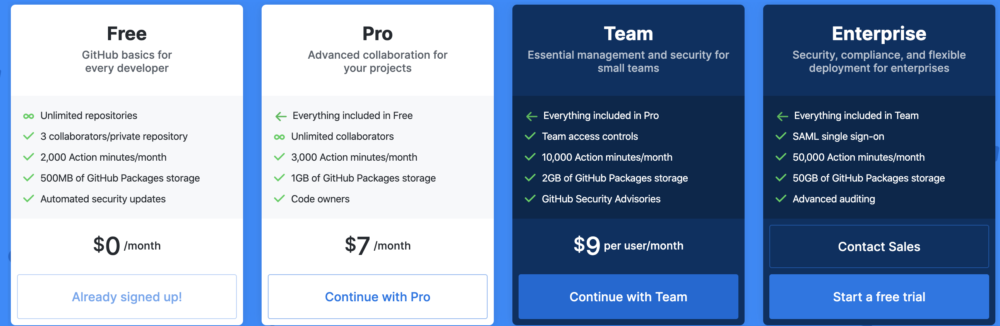

# Intro to Github Actions

# Overview

- Based on Workflows
- Allows you to run "actions" on your repo (e.g. build and run tests).
- To create a workflow you can create a file under the following folder:

    ```swift
    .github/workflows/myworkflow.yml
    ```

    Other things that go into .github folder?  
    .github/pull_request_template.md  # to create a template for Pull request

    - Using YAML (.yml or .yaml)
    - You can start writing a github action workflow from scratch or use the templates files to get started.
    - Let's review some sample workflows
        - Mark stale issues and pull requests
- Can I play around with it, now? Yes, you can use 2000 mins/month.
    - Pricing

        

    - macOS runners are 10x more expensive

## YAML Basic Structure

- YAML Ain't Markup Language
- .yml or .yaml
- indentation to define scope and object

    ```yaml
    fullname:
    	firstname: "Mo"
    	lastname: "Farajmandi"
    ```

    alternatively

    ```yaml
    student:
    	fullname: {firstname: "Mo", lastname: "Farajmandi"}
    ```

- you can define list using `-` or `["item1", "item2"]`

    ```yaml
    list: # same as ["item1", "item2"]
    	- item1
    	- item2
    ```

- if you want to preserve the formatting of text

    ```yaml
    commands: |
    	echo "Hello"
    	echo "World!"
    ```

# Github Action Basic Syntax

```swift
name: CI

on: [push, pull_request]

jobs:
  build:

    runs-on: ubuntu-latest

    steps:
    - uses: actions/checkout@v2
    - name: Run a one-line script
      run: echo Hello, world!
    - name: Run a multi-line script
      run: |
        echo Add other actions to build,
        echo test, and deploy your project.
```

You can either any editor really, but if you are looking for editor support, you can use:

- Github inline editor
- VSCode - Install YAML plugin

# Running Jobs

## Triggers

Actions are automatically triggered once placed in `.github/workflows/someaction.yml` and any number of `events` ADD LINK is fired. Here are three common cases:

- `push` pushes to the repo, can add filters per branch, etc. (?)
- `pull_request` pull request against common branches

    ```yaml
    on:
      pull_request:
        branches: [ master ]
    ```

    Note: By default, a workflow only runs when a pull_request's activity type is opened, synchronize, or reopened. To trigger workflows for more activity types, use the types keyword.

- `schedule`

    ```yaml
    on:
      schedule:
        # * is a special character in YAML so you have to quote this string
        - cron:  '*/15 * * * *'
    ```

### Conditional Builds

- You can use conditional  `if` either at the job level or at a step of a job

    ```yaml
    # make a step conditional
    steps:
      - name: An example step
        if: github.event_name == 'pull_request'
    ```

- Run when specific a pull request is labeled

    ```yaml
    # make specific job conditional to run on self-hosted runner
    jobs:
      test:
        if: contains(github.event.pull_request.labels.*.name, 'test')
        runs-on: self-hosted
    ```

- Run specific Test plan(?)

## Contexts

- To evaluate an expression rather than treat it as a string `${{ <expression> }}`

### Keeping secrets

```yaml
# setting environment variables using 
env:
          NEXUS_PLATFORM_EMAIL: ${{ secrets.NEXUS_PLATFORM_EMAIL }}
          NEXUS_PLATFORM_PASS: ${{ secrets.NEXUS_PLATFORM_PASS }}
          NEXUS_PLATFORM_USER: hardcodedUserName
```

## Multiple jobs simultaneously

- Parallel by default
    - Unless waiting on available runner (e.g. if you are using single self-hosted runner)
    - Or if you use define `needs: id or ids of other jobs`

# Self-hosted

- You can enable self-hosted runners by going to `Setting` > `Actions` > `Add runner`

# Debugging

- [You can download the logs for your action](https://help.github.com/en/actions/configuring-and-managing-workflows/managing-a-workflow-run)
- [Enabling debug logging](https://help.github.com/en/actions/configuring-and-managing-workflows/managing-a-workflow-run): Set the following secrets for your repo
    - `ACTIONS_RUNNER_DEBUG` to `true`
    - `ACTIONS_STEP_DEBUG` to `true`
- Use self-hosted runners
- Using tmate [https://github.com/marketplace/actions/debugging-with-tmate](https://github.com/marketplace/actions/debugging-with-tmate)

# References

- [Software on installed on hosted Github action runners](https://help.github.com/en/actions/reference/software-installed-on-github-hosted-runners)
- [Triggers](https://help.github.com/en/actions/reference/events-that-trigger-workflows)
- [Context and Conditional statements](https://help.github.com/en/actions/reference/context-and-expression-syntax-for-github-actions)
- [Run your actions locally](https://github.com/nektos/act)
- [Example Starter Workflows](https://github.com/actions/starter-workflows)
